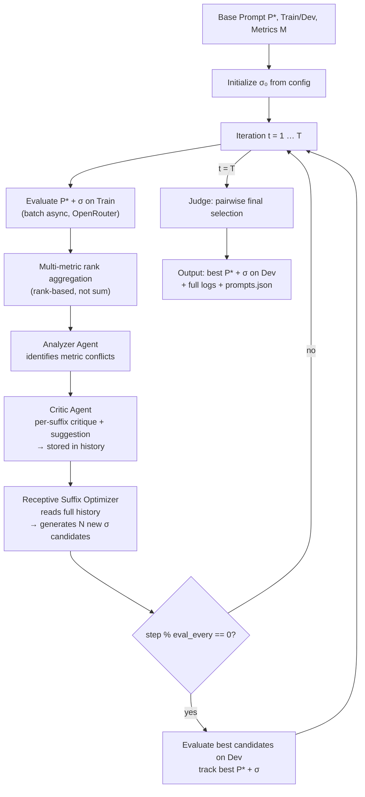

# MoRe-AST Architecture

## Flow Diagram



## Module Layout

```
more_ast/
├── config.toml          # OpenRouter, optimization, metrics, logging
├── prompts.toml         # Analyzer, Critic, Optimizer, Judge meta-prompts
├── run.py               # CLI entry point
├── trainer.py           # MoReASTTrainer main loop
├── metrics.py           # Rouge1/2/L, BERTScore wrappers
├── utils.py             # TOML loader, path setup
├── llms/
│   └── openrouter.py    # OpenRouter API client (LargeLanguageModel)
└── core/
    ├── suffix.py        # SuffixCandidate dataclass
    ├── multi_metric.py  # MultiMetricRanker (rank-based aggregation)
    ├── analyzer.py      # Analyzer agent
    ├── critic.py        # Critic agent
    ├── optimizer.py     # ReceptiveSuffixOptimizer
    └── judge.py         # Judge agent (pairwise)
```

## Data Flow

1. **Config** (`config.toml`) → API keys, models, steps, initial suffix
2. **Prompts** (`prompts.toml`) → Four meta-prompts filled at runtime
3. **Train** → Examples with `x` (input), `y` (reference)
4. **Evaluate** → `task_llm.batch_generate` → predictions → `ranker.score` → per-metric scores
5. **Rank** → `MultiMetricRanker.compute_rank_scores` → average rank per candidate
6. **Analyzer** → Best candidate outputs + scores → conflict analysis, improvement directions
7. **Critic** → Top-K suffixes + outputs → strengths, weaknesses, recommendation
8. **Optimizer** → History (suffixes, critiques, analyzer) → new suffix candidates
9. **Judge** → Pairwise (A vs B) → winner + justification
